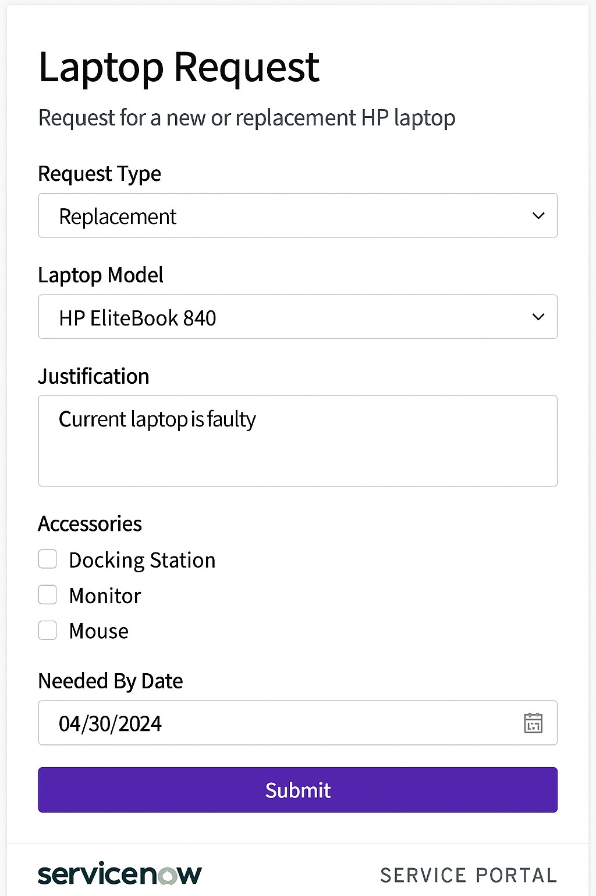

# ServiceNow Laptop Request Catalog Item Implementation Project

### Naan Muthavan Project  
**Author:** Guru Prasath E  
**Institution:** Amrita College of Engineering and Technology  

---

## 📘 Overview
This project implements a ServiceNow Service Catalog Item that automates laptop requests within an organization.  
It covers form design, workflow automation, and fulfillment tracking.

---

## 🧩 Key Features
- Dynamic Service Catalog form for laptop requests  
- Automated manager approval and IT fulfillment  
- Email notifications for each stage  
- ServiceNow Flow Designer workflow  

---

## 🧠 Implementation
1. Created a catalog item named **Laptop Request** under *Hardware Requests* category.  
2. Added variables such as Request Type, Laptop Model (HP), Justification, etc.  
3. Configured a UI Policy for replacement cases.  
4. Designed an automated flow with approvals and fulfillment tasks.  
5. Set up notifications for submission, approval, and completion.  

---

## 🧭 Workflow

---

## 💻 Form Mock-up

---

## 📜 License
This project is licensed under the [MIT License](LICENSE).

---

© 2025 Guru Prasath E, Amrita College of Engineering and Technology
